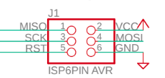
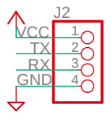

# Setting up the hardware

These instructions will help you setup your hardware for development. At the end of this guide you should have connected your Multiflexmeter to your computer.

## Requirements

This is a list of requirements with their purposes.

- Multiflexmeter V3 board - *You will be programming this*
- USB AVR ISP - *Used to upload new code to the device*
- USB to TTL Serial - *Used for serial communication with the device. Useful for debugging*
  - Tip: *An FTDI Programmer is easy to use for this.*

## Connections

There are two groups of connection pins available on the Multiflexmeter. One group contains the SPI pins and the other group contains the UART pins.

### ISP

Connect the ISP to the board according to the following ISP header. The provided header should fit the [Diamex ISP](https://www.conrad.nl/p/diamex-programmeeradapter-usb-isp-stick-avr-7200-842379) right away.



### Serial communication

Connect your USB to TTL to the UART header on the board and your computer. See the following layout.



You should now be able to receive the information spit out by the Multiflexmeter using the following command and resetting the Multiflexmeter.

```
pio device monitor
```

If you are not receiving anything, try swapping the TX and RX pins. If you are still not receiving anything, read [the troubleshoot guide here](serial_monitor.md#Troubleshooting).


# Next steps

- [Setting up the software](software.md)
- [Connecting the serial monitor](serial_monitor.md)